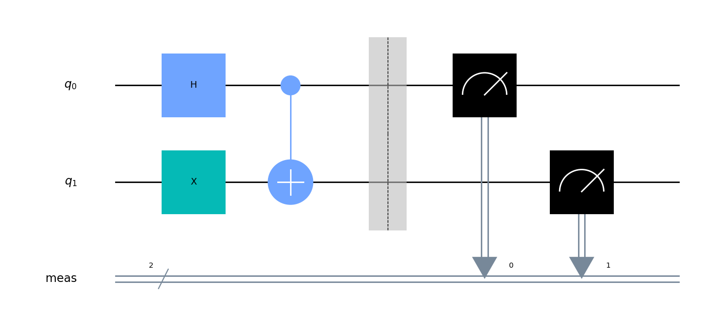
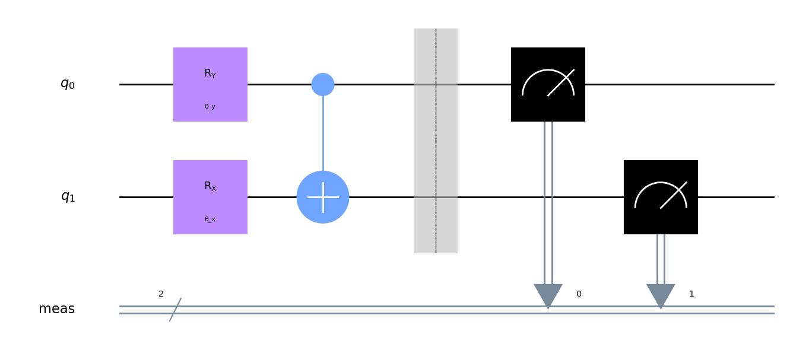
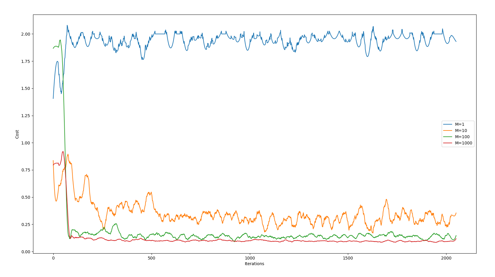

QOSF Task 2
===============

My attempt at a solution for Task 2 of the screening process for QOSF's mentorship program.

# Problem

Implement a circuit that returns |01> and |10> with equal probability.

Requirements :
- The circuit should consist only of CNOTs, RXs and RYs.
- Start from all parameters in parametric gates being equal to 0 or randomly chosen.
- You should find the right set of parameters using gradient descent (you can use more
advanced optimization methods if you like).
- Simulations must be done with sampling (i.e. a limited number of measurements per
iteration) and noise.

Compare the results for different numbers of measurements: 1, 10, 100, 1000.

# Solution

## Theory

The actual problem statement requires us to use sampling to figure out the parameters, but we may be able to analyze this theoretically to guide us in our search for an appropriate ansatz.  Starting from a vector of |0> qubits, we would like to generate |01> + |10>.  Below is the simplest way to do this:



We can replace H = Ry(pi/2) and X = Rx(pi) to meet the gate constraints provided (up to a global phase).  All in all, this suggests the following ansatz:



There are some degeneracies for which values of theta give the correct probability distribution, but we expect `theta_y` to be some half-integer of pi, and `theta_x` to be some odd integer of pi.

## Experiment

Now that we have the ansatz, we can use Qiskit to find the actual parameters.  The Qiskit textbook[^1] suggests SPSA for simulations with noise, so we'll use that.  Qiskit also ships with noise models derived from various IBMQ computers, so we randomly pick one derived from the IBM VIgo here.

```py
    # Get noise model
    vigo_backend = FakeVigo()
    self.noise_model = NoiseModel.from_backend(vigo_backend)
    self.coupling_map = vigo_backend.configuration().coupling_map
    self.basis_gates = self.noise_model.basis_gates
```

Our goal is to create a circuit that generates |01> and |10> with equal probability, so our cost function should reflect this.  Here we use the sum of absolute values of errors between the expected and actual probabilities.

```py
    target_pd = {
            "00": 0,
            "01": 0.5,
            "10": 0.5,
            "11": 0
    }
    
    cost = np.sum([np.abs(observed_pd[k] - target_pd[k]) for k in Task2.POSSIBLE_OUTCOMES])
```

# Results

The script outputs parameters for values of `M=[1, 10, 100, 1000]`, where M is the number of measurements per iteration.

```
Running test: M=1
====================
Params:
    theta_y: 2.3101941359247484 ( 0.7353576324686674 * pi )
    theta_x: -0.308720184071524 ( -0.09826868665444571 * pi )

Running test: M=10
====================
Params:
    theta_y: 1.5957458026784974 ( 0.5079416648288542 * pi )
    theta_x: 2.8271051395144537 ( 0.8998955151884555 * pi )

Running test: M=100
====================
Params:
    theta_y: 1.595947012571713 ( 0.5080057119270627 * pi )
    theta_x: 3.226977050585924 ( 1.0271786976897102 * pi )

Running test: M=1000
====================
Params:
    theta_y: 1.5621648683948892 ( 0.49725252145909354 * pi )
    theta_x: 3.220890587616747 ( 1.0252413163547294 * pi )
```

Remember that we expect half-integer multiples of pi for `theta_y` and odd integer values of pi for `theta_x`.  In this regard, M=1 fares poorly, with results getting better with higher M values (at M=100 we start seeing diminishing returns).

If we plot the costs over time (see `diagrams.py`) we get the following:



M=1 never even attempts to converge, whereas the other trials reach steady-state after 100 iterations or so, with larger M values demonstrating better results.

# Bonus Question

Bonus question:

    How to make sure you produce state |01> + |10> and not |01> - |10> ?

TODO need to think about this some more

[^1]: <https://qiskit.org/textbook/ch-applications/vqe-molecules.html#Parameter-Optimization>
